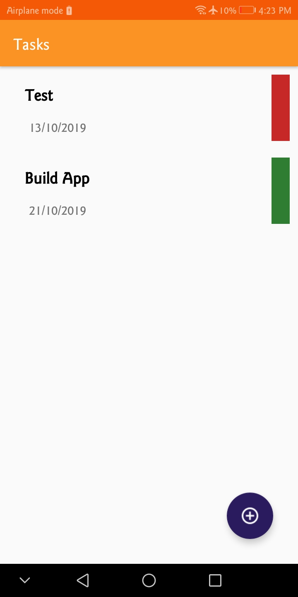
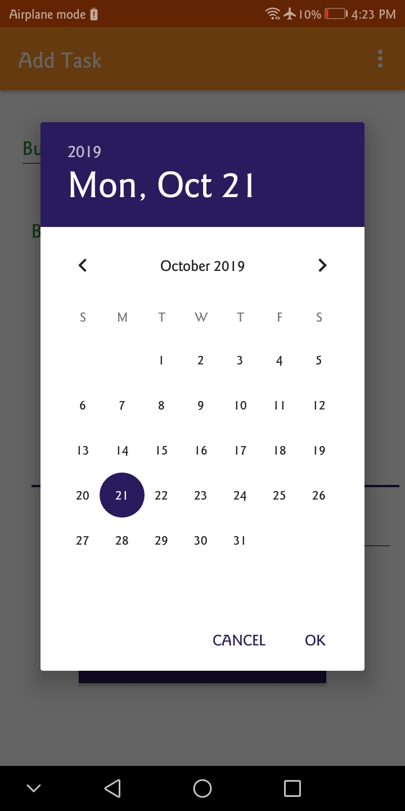
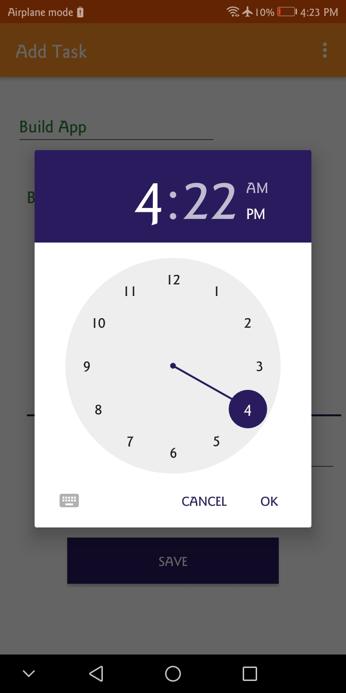

# Done

A Todo app that let the user decide the day and time for his task and sending him notification at that date.
uses:
- ROOM database
- View Models
- Executors
- LiveData
- services
- Alarm Manager and Broadcast Receivers
- Notifications

        

